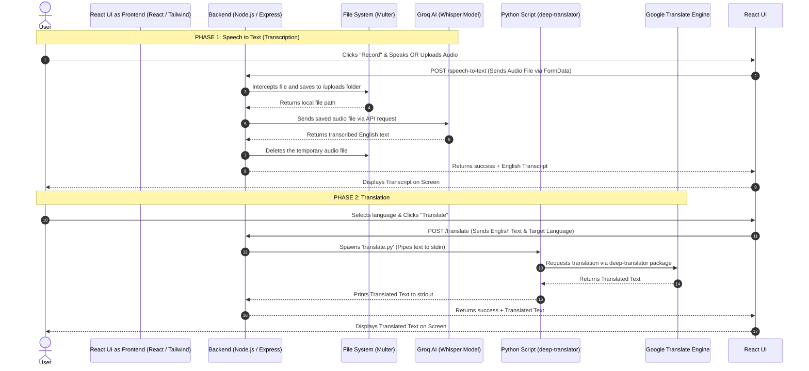

# Project Architecture Flowchart

Here is the complete step-by-step visual architecture of how your application processes audio, generates text, and translates it. 

## Key Components:
- **Frontend (React)**: Handles the microphone, file dropping, and UI layout.
- **Backend (Express)**: Acts as the secure middleman. It hides your API keys and orchestrates the heavy lifting.
- **Multer**: Safely stores incoming files to your hard drive so the Groq API can read them.
- **Groq AI**: The incredibly fast engine running the "Whisper" model to turn speech into text.
- **Python**: A local child process spawned by Node.js, specifically used because Python has better free translation libraries than Node.js.
