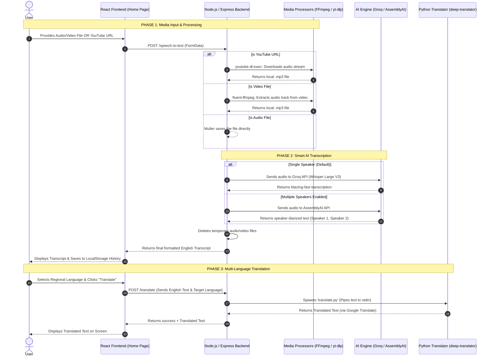

# Project Architecture Flowchart

Here is the complete visual architecture of how your application processes audio, videos, YouTube URLs, generates text via AI, and translates it. 

## Key Components Explained:
- **Frontend (React Router)**: A multi-page application holding the Home page (for processing) and a History dashboard (powered by browser LocalStorage).
- **Backend (Express)**: Acts as the secure orchestrator. It manages API keys, temporary files, and routes audio to the correct AI model.
- **Media Processors**: 
  - `fluent-ffmpeg`: Strips audio tracks out of heavy video files (MP4/MOV) locally so the APIs don't reject them.
  - `youtube-dl-exec`: Intercepts YouTube links and securely rips the audio stream.
- **Groq AI (Whisper)**: The ultra-fast default engine for standard transcription and auto-language detection.
- **AssemblyAI**: Used specifically when the "Multiple Speakers" toggle is active to identify distinct human voices.
- **Python**: A local child process spawned by Node.js, specifically used because Python has access to robust free translation packages (`deep-translator`).
